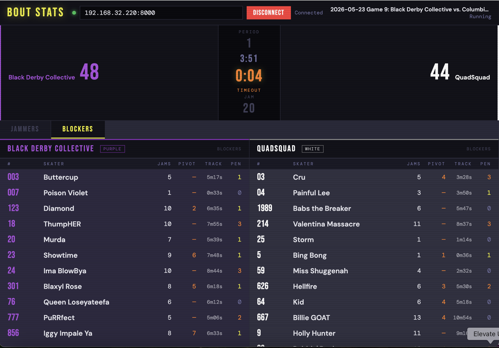
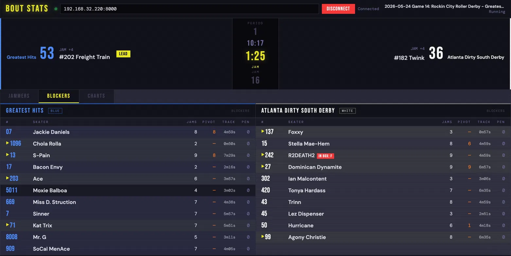

# CRG Bout Stats

A real-time roller derby bout statistics dashboard that connects directly to a [CRG Scoreboard](https://github.com/rollerderby/scoreboard) instance via WebSocket and displays live jammer, pivot, and blocker stats as the game unfolds.

## Features

- **Live connection** to CRG via WebSocket — no server required, runs as a single HTML file.  Can be loaded or reloaded mid-game and will contain data for the entire game!
- **Jammers tab** — lead percentage, calloff percentage, points for/against, track time, penalty count, star passes given; initial trip indicator and IN BOX status on the active jammer
- **Calloff percentage** — tracks how often a jammer with lead calls off the jam vs. riding it out; excludes in-progress jams and injury continuations
- **Star pass pivot section** — points scored after receiving the star, track time as jammer, passed-from breakdown; columns aligned with jammer table
- **Blockers tab** — jams played, pivot jams, track time, penalty count
- **Charts tab** — cumulative score by jam, lead jams doughnut, and penalties over time; updates on demand
- **Live score bar** — current score, jam clock (interpolated), period clock, lead indicator, power jam alert, active jammer with initial trip and IN BOX status
- **Previous jammer panel** — during lineup/timeout/intermission, shows the last jam's jammer with their game stats (lead%, for, against, net, penalties, jams) for announcer reference
- **Clock states** — correctly displays JAM / LINEUP / TIMEOUT / INTERMISSION with the appropriate countdown
- **Jersey color theming** — reads `AlternateName(operator)` from CRG and tints each team panel accordingly
- **Derby number sort** — skaters sorted in standard derby order (string sort preserving leading zeros)
- **Active skater indicators** — arrow markers on current jam's jammer, pivot (post star pass), and all four blockers; clears automatically between jams
- **Game transition handling** — detects new game via `ScoreBoard.CurrentGame` and resets stats automatically
- **Auto-connect** — supports URL hash for bookmarkable connections: `crg-jammer-stats.html#192.168.1.100:8000`

## Usage

1. Copy `crg-jammer-stats.html` into the CRG `html` folder on the scoreboard machine
2. Open `http://<CRG-IP>:8000/crg-jammer-stats.html` from any machine on the same network
3. Enter the CRG IP:port in the connection bar and click Connect

Or bookmark with auto-connect: `http://<CRG-IP>:8000/crg-jammer-stats.html#<CRG-IP>:8000`

## Requirements

- CRG Scoreboard v2025.x (tested on v2025.9)
- Any modern browser on the same network as the CRG machine
- No build step, no dependencies, no server

## Notes

- Must be served over HTTP (not opened as a local `file://`) so the browser allows the WebSocket connection
- The CRG machine's Jetty server handles this automatically when the file is placed in the `html` folder
- Track time reflects jam clock time only (not lineup time)
- Star pass splits track time between jammer and pivot at the moment of the pass
- Pivot points-against is not tracked. CRG records star pass jams as separate entries and does not split opponent scoring across the SP boundary, so this stat cannot be accurately attributed. Pivot FOR (points scored after receiving the star) is accurate.
- Calloff detection uses jam duration (<119s with lead = called off). Official timeout and injury continuation jams are excluded.

## License

GPL-3.0 — see [LICENSE](LICENSE) for details.
